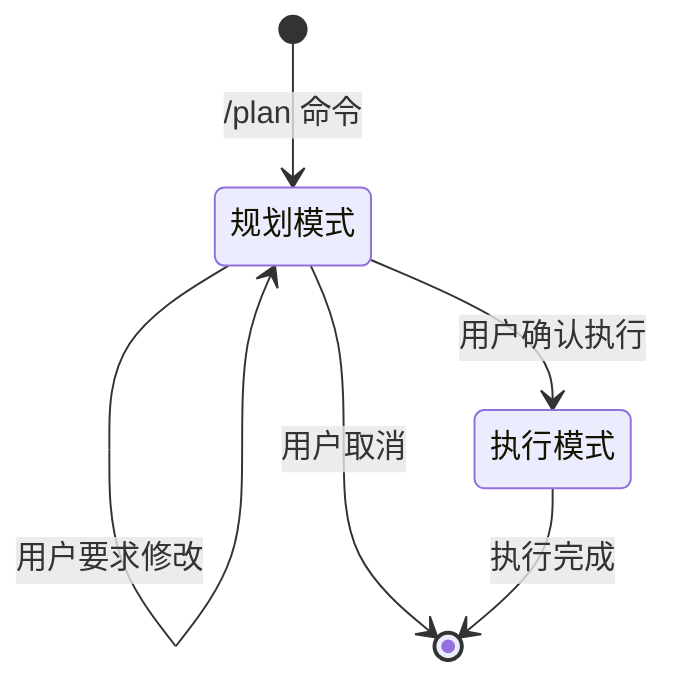

# /plan - 规划模式 Skill

## 概述

`/plan` 是一个让 AI 进入**纯规划模式**的命令，在此模式下 AI 只输出详细的执行计划，而不会实际执行任何操作。待用户审核通过后，AI 才会进入执行阶段。

## 使用方式

```
/plan <你的任务描述>
```

## 工作流程

```
用户输入: /plan 创建一个用户登录系统
    ↓
AI 识别到 /plan 命令 → 进入【规划模式】
    ↓
[阶段1: 需求分析]
- 分析用户意图
- 识别任务类型和范围
- 列出需要实现的功能点
    ↓
[阶段2: 技术调研] (可选，视复杂度)
- 如需最新技术信息，使用 SearchWeb/FetchURL 查询
- 收集最佳实践和参考资料
    ↓
[阶段3: 详细规划]
- 制定分步骤执行计划
- 评估每个步骤的风险和依赖
- 列出所需资源和工具
    ↓
[阶段4: 输出计划]
- 向用户展示完整的执行方案
- 等待用户审核
    ↓
用户响应:
  ✅ "执行" / "开始" / "确认" → 进入【执行模式】
  📝 "修改..." → 根据反馈调整计划，再次等待审核
  ❌ "取消" → 退出规划模式
```

## 规划内容模板

当进入规划模式时，AI 应按照以下结构输出计划：

```markdown
## 📋 任务规划

**任务**: [任务简述]

---

### 1️⃣ 需求分析
- **目标**: [任务目标]
- **范围**: [涉及的范围]
- **关键功能**: 
  - [功能1]
  - [功能2]
  - ...

### 2️⃣ 技术方案
- **技术选型**: [选择的技术栈及理由]
- **参考资料**: [如进行过联网查询，列出参考链接]
- **依赖分析**: [外部依赖和前置条件]

### 3️⃣ 执行步骤

| 步骤 | 操作内容 | 预计产出 | 风险/注意事项 |
|------|----------|----------|---------------|
| 1 | [具体操作] | [产出物] | [风险提示] |
| 2 | [具体操作] | [产出物] | [风险提示] |
| ... | ... | ... | ... |

### 4️⃣ 资源需求
- **文件操作**: [需要创建/修改的文件]
- **外部资源**: [需要下载/引用的资源]
- **权限要求**: [需要的系统权限]

### 5️⃣ 回滚方案
- [如操作失败，如何恢复原状]

---

## ⏳ 等待审核

请审核以上计划：
- ✅ **执行** - 我将按照计划开始执行
- 📝 **修改** - 告诉我需要调整的地方
- ❌ **取消** - 放弃此任务
```

## 触发条件

当用户输入满足以下条件时，激活本 skill：

1. 消息以 `/plan` 开头（不区分大小写，支持 `/Plan`, `/PLAN`）
2. 消息包含 "plan mode"、"规划模式" 等关键词

## 执行条件

规划模式下 **禁止** 执行的操作：
- ❌ 写入文件（WriteFile, StrReplaceFile）
- ❌ 执行命令（Shell）
- ❌ 创建子任务（Task）
- ❌ 修改数据库
- ❌ 调用外部 API

规划模式下 **允许** 执行的操作：
- ✅ 读取文件/代码（ReadFile, Glob, Grep）
- ✅ 搜索网络（SearchWeb, FetchURL）
- ✅ 与用户对话（AskUserWithOption）
- ✅ 分析现有代码

## 状态流转



## 示例对话

### 示例 1: 简单任务

**用户**: `/plan 创建一个 Python 工具函数，用于计算斐波那契数列`

**AI**: 
```
## 📋 任务规划

**任务**: 创建斐波那契数列计算工具函数

### 1️⃣ 需求分析
- **目标**: 实现一个高效计算斐波那契数列的 Python 函数
- **范围**: 单个 Python 文件，包含核心函数和简单测试
- **关键功能**: 递归/迭代实现、输入验证、性能优化选项

### 2️⃣ 技术方案
- **实现方式**: 提供递归和迭代两种实现，迭代法作为默认（O(n)时间复杂度）
- **可选优化**: 使用 LRU 缓存优化递归版本

### 3️⃣ 执行步骤

| 步骤 | 操作内容 | 预计产出 | 风险/注意事项 |
|------|----------|----------|---------------|
| 1 | 创建 fibonacci.py 文件 | fibonacci.py | 检查文件是否已存在 |
| 2 | 实现 fibonacci(n) 函数 | 迭代实现代码 | 处理 n<0 的边界情况 |
| 3 | 添加类型注解和文档字符串 | 完整函数定义 | 遵循 PEP 257 规范 |
| 4 | 编写简单测试用例 | 测试代码块 | 覆盖正常和边界情况 |

### 4️⃣ 资源需求
- **文件**: 创建 `fibonacci.py`
- **依赖**: 仅需 Python 标准库 (functools 用于可选缓存)

---

## ⏳ 等待审核

请审核以上计划，回复「执行」开始，或告诉我需要调整的地方。
```

**用户**: `执行`

**AI**: [开始创建文件并编写代码...]

---

### 示例 2: 复杂任务（需联网查询）

**用户**: `/plan 为我的 FastAPI 项目添加 OAuth2 认证功能`

**AI**: 
```
## 📋 任务规划

**任务**: 为 FastAPI 项目添加 OAuth2 认证

### 1️⃣ 需求分析
- **目标**: 实现基于 OAuth2 的用户认证系统
- **范围**: 登录接口、Token 生成、受保护路由
- **关键功能**: JWT Token、密码哈希、用户模型

### 2️⃣ 技术调研
让我先查询一下最新的 FastAPI OAuth2 最佳实践...

[SearchWeb: "FastAPI OAuth2 JWT best practice 2024"]
[FetchURL: 相关文档]

- **技术选型**: 
  - OAuth2 方案: Password Bearer with JWT
  - JWT 库: python-jose
  - 密码哈希: passlib (bcrypt)
  - Token 存储: HTTP-only Cookie + Header
- **参考资料**: 
  - FastAPI 官方文档: https://fastapi.tiangolo.com/tutorial/security/oauth2-jwt/
  - [其他相关链接]

### 3️⃣ 执行步骤
...
```

## 特殊处理

### 1. 文件已存在
如果规划中发现某些文件已存在，应在计划中说明：
- 文件当前内容分析
- 是修改现有文件还是创建新文件
- 修改可能带来的风险

### 2. 依赖冲突
如果可能产生依赖冲突，应在计划中列出：
- 当前环境已安装的版本
- 需要安装的新依赖
- 版本兼容性分析

### 3. 不可逆操作
如果计划中包含不可逆操作（如删除数据），必须：
- 用 ⚠️ 醒目提示
- 说明备份方案
- 提供替代方案

## 审核指令识别

用户以下回复视为**确认执行**：
- "执行"
- "开始"
- "确认"
- "ok"
- "好的"
- "可以"
- "Go"
- "Proceed"
- "Yes"

用户以下回复视为**取消**：
- "取消"
- "放弃"
- "算了"
- "No"
- "Cancel"
- "Abort"

其他回复视为**修改意见**，应根据反馈调整计划。

## 最佳实践

1. **充分调研**: 复杂任务应先联网查询最新资料
2. **分步详细**: 每个步骤应具体到可执行的程度
3. **风险评估**: 主动识别潜在风险并给出应对方案
4. **保持对话**: 计划过程中可与用户确认不清楚的地方
5. **代码预览**: 如涉及代码，可在计划中展示关键代码片段（但不写入文件）
