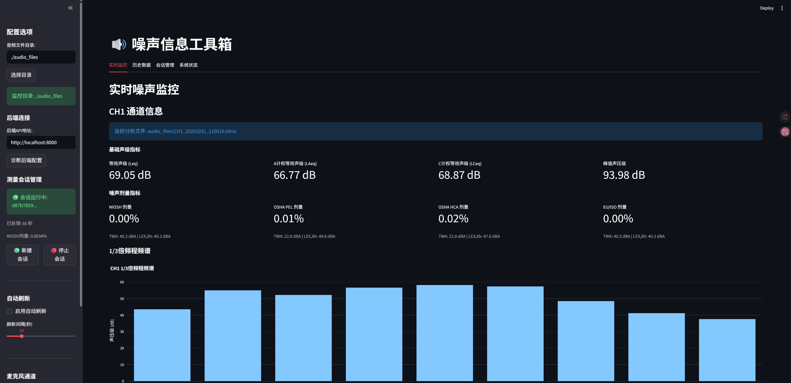
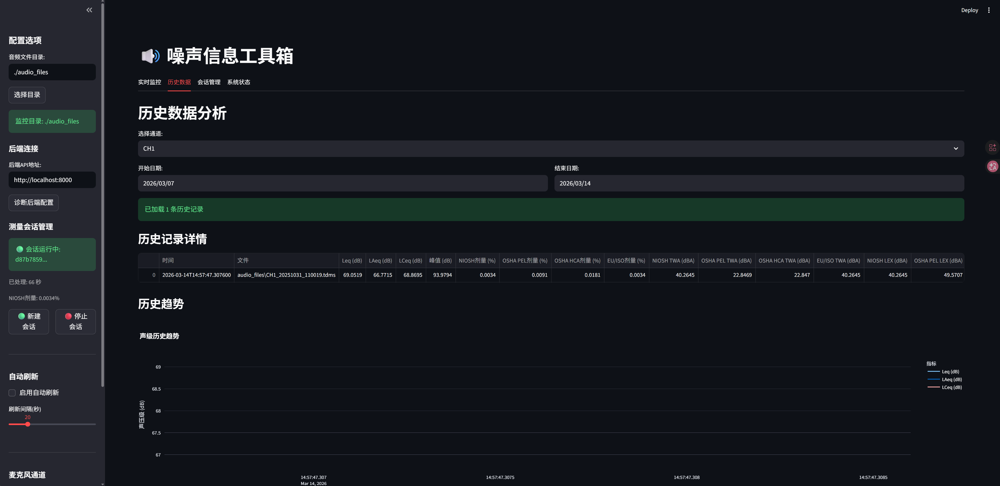
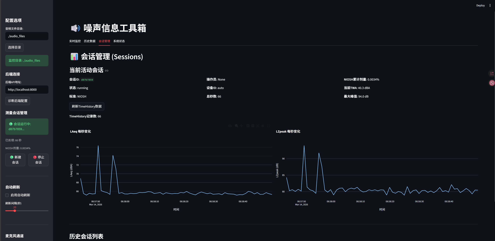
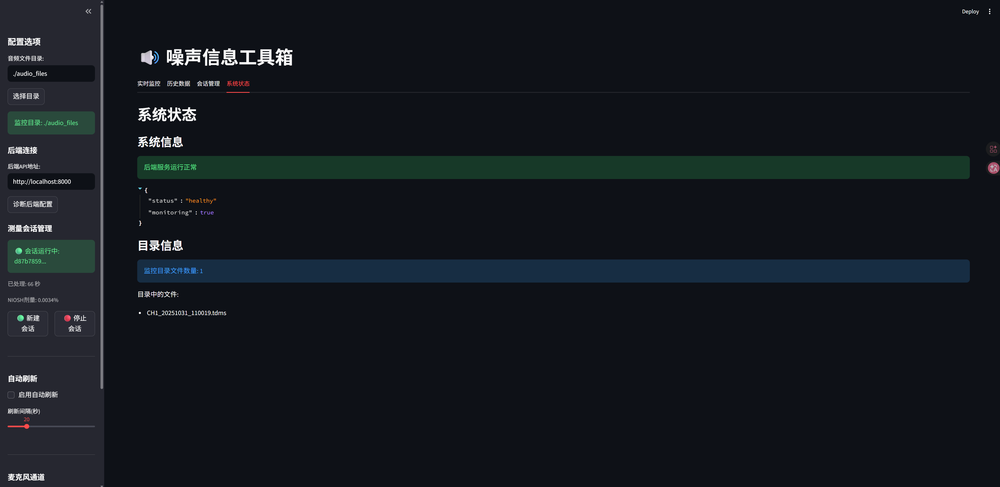

# 个人噪声剂量计数据分析平台 (Noise Info Toolkit)

[](https://www.python.org/downloads/)
[](https://fastapi.tiangolo.com/)
[](https://streamlit.io/)
[](LICENSE)

## 项目简介

本项目是基于《个人噪声剂量计总体技术白皮书》构建的**噪声数据分析平台**，严格遵循白皮书中的数据模型与计算规范，支持对职业性噪声暴露数据的标准化处理、实时分析和可视化展示。

**对应设计方案**：`doc/DESIGN_PROPOSAL.md`

平台采用 **"个人噪声剂量计 + 标准化数据结构 (3+1 模型) + ETL 管线"** 的技术架构，旨在：
- 实现白皮书定义的 **TimeHistory / EventLog / Metadata / Profiles 3+1 数据模型**
- 支持 **NIOSH/OSHA_PEL/OSHA_HCA/EU_ISO** 四种标准的噪声剂量计算
- 支持 **峰度 β (Kurtosis)** 等复杂噪声指标的计算与分析
- 实现 **冲击噪声事件检测** 与 **环形缓冲音频捕获**
- 为职业性噪声性听力损失 (NIHL) 风险评估与标准修订提供数据基础设施

## 核心功能

### 1. 数据处理能力
- **TDMS 文件支持**：自动检测和处理 TDMS 格式的噪声信号文件
- **实时文件监控**：监控指定目录中的新音频文件并自动处理
- **多通道分析**：支持 CH1、CH2 等多通道数据同时处理

### 2. 噪声指标计算
- **等效声级**：LAeq、LCeq、LZeq（支持 NIOSH、OSHA、EU/ISO 等多种剂量档）
- **峰值声压级**：LZpeak、LCpeak（真峰值检测）
- **时间加权声级**：LAFmax、LASmax（Fast/Slow 加权）
- **频谱分析**：1/3倍频程频谱计算
- **峰度指标**：超额峰度 β 计算（支持复杂噪声风险模型）
- **剂量与 TWA**：基于不同标准的剂量百分比和时间加权平均值

### 3. 数据标准化
遵循白皮书定义的 **3+1 数据表结构**：
- **TimeHistory**：时间历程表（1s 粒度，含 LAeq、LCeq、LZpeak、剂量增量等）
- **EventLog**：事件表（冲击噪声事件，含 β、LAE、音频路径等）
- **Metadata**：元数据表（仪器信息、校准记录、采样参数等）
- **Profiles**：剂量档参数表（NIOSH、OSHA_PEL、OSHA_HCA、EU_ISO 等）

### 4. 可视化与交互
- **实时监控**：当前噪声指标、1/3倍频程频谱、时间历程图
- **历史数据查询**：按时间范围、文件、通道筛选
- **会话管理**：测量会话创建、TimeHistory 每秒数据查看、累计剂量跟踪
- **系统状态监控**：后端健康检查、目录信息、连接诊断

### 5. 会话管理 (Session)
平台采用**会话机制**来组织和管理噪声测量数据，每个会话代表一次完整的测量过程：
- **自动创建会话**：处理音频文件时自动创建新会话
- **实时剂量累计**：会话期间实时计算并累计噪声剂量
- **TimeHistory 存储**：每秒保存一条测量记录（LAeq、LZpeak、剂量增量等）
- **会话摘要**：结束时自动生成摘要（总时长、平均声级、TWA、总剂量等）

### 6. 事件检测 (Event Detection)
根据白皮书要求实现冲击噪声事件检测：
- **触发条件**：
  - 声级触发：LZeq_125 ≥ 90-95 dB（125ms窗口）
  - 峰值触发：LCpeak ≥ 130 dB
  - 斜率触发：ΔLZeq ≥ 10 dB/50ms
- **去抖动机制**：避免重复触发，默认间隔0.5秒
- **环形缓冲**：12秒缓冲（2秒pre-trigger + 8秒post-trigger）
- **事件音频**：自动保存事件前后的音频片段（WAV格式）
- **EventLog**：记录事件的起止时间、峰值、SEL、峰度等指标

## 技术架构

### 后端 (FastAPI)
```
TDMS/WAV 文件 → FileMonitor → TimeHistoryProcessor → Database
                                      ↓
                           SummaryProcessor (时段汇聚)
                                      ↓
                                WebSocket/API ← Streamlit 前端
```

- **Web 框架**：FastAPI + Uvicorn (ASGI)
- **数据库**：SQLite + SQLAlchemy ORM
- **音频处理**：librosa、soundfile、acoustics
- **科学计算**：numpy、pandas、scipy
- **文件监控**：watchdog
- **TDMS 处理**：nptdms

### 前端 (Streamlit)
- **界面框架**：Streamlit
- **数据可视化**：plotly
- **实时通信**：REST API + WebSocket

### 数据流
1. `AudioFileMonitor` 监控目录检测到新文件
2. `TDMSConverter` 将 TDMS 转换为 WAV 格式
3. `TimeHistoryProcessor` 按秒处理音频，计算 S1-S4 原始矩和峰度
4. `SummaryProcessor` 将秒级数据汇聚到时段级（如 1 分钟）
5. `DatabaseManager` 按 3+1 表结构保存到 SQLite
6. `Streamlit` 前端通过 API 获取数据展示

## 界面展示

### 1. 实时监控
展示当前噪声指标（Leq、LAeq、LCeq、峰值声压级）、四种标准的剂量百分比（NIOSH/OSHA/EU/ISO）以及1/3倍频程频谱分析。



### 2. 历史数据分析
支持按时间范围查询历史记录，展示声级历史趋势图。



### 3. 会话管理
显示当前活动会话状态，包括TimeHistory每秒数据（LAeq/LZpeak变化曲线）和历史会话列表。



### 4. 系统状态
显示后端服务健康状态、监控目录文件数量等信息。



---

## 快速开始

### 环境要求
- Python 3.11+
- Windows/Linux/macOS

### 安装依赖

```bash
pip install -r requirements.txt
```

### 启动服务

**方式 1：分别启动**

```bash
# 启动后端 (端口 8000)
uvicorn main:app --host 0.0.0.0 --port 8000 --reload

# 启动前端 (端口 8501)
streamlit run streamlit_app.py
```

**方式 2：使用启动脚本**

```bash
python start_server.py
```

### 访问应用

- **前端界面**：http://localhost:8501
- **后端 API 文档**：http://localhost:8000/docs
- **后端健康检查**：http://localhost:8000/health

---

## 会话机制使用指南

### 什么是会话 (Session)

**会话**是平台的核心概念，代表一次完整的噪声暴露测量过程。每个会话具有唯一的 ID，用于关联该次测量的所有数据：
- **TimeHistory**：每秒的声级和剂量数据
- **ProcessingResult**：整体噪声指标（Leq、频谱等）
- **SessionSummary**：会话级别的汇总统计

### Streamlit 前端中的会话机制

#### 1. 工作原理

```
┌─────────────────┐     ┌─────────────────┐     ┌─────────────────┐
│   用户操作      │────▶│   后端处理      │────▶│   数据存储      │
│                 │     │                 │     │                 │
│ • 新建会话      │     │ • 创建Session   │     │ • Session表     │
│ • 放入音频文件  │     │ • 每秒处理      │     │ • TimeHistory表 │
│ • 停止会话      │     │ • 计算剂量      │     │ • Processing表  │
└─────────────────┘     └─────────────────┘     └─────────────────┘
         │                                               │
         │              ┌─────────────────┐             │
         └─────────────▶│  Streamlit展示  │◀────────────┘
                        │                 │
                        │ • 实时监控图表  │
                        │ • 会话管理列表  │
                        │ • 历史数据查询  │
                        └─────────────────┘
```

#### 2. 使用流程

**步骤 1：创建会话**
- 在 Streamlit 侧边栏点击 **"新建会话"**
- 系统会创建一个 RUNNING 状态的会话
- 侧边栏显示当前会话 ID（前 8 位）和已处理秒数

**步骤 2：处理音频文件**
- 将 TDMS 或 WAV 文件放入监控目录
- 后台自动检测并处理文件
- **实时监控**标签页显示每秒的 TimeHistory 数据：
  - LAeq 每秒变化曲线
  - LZpeak 每秒变化曲线
  - NIOSH/OSHA 剂量累计曲线

**步骤 3：查看会话数据**
- **实时监控**页：显示当前/最新会话的每秒数据
- **会话管理**标签页：
  - 查看所有历史会话列表
  - 点击任意会话查看详细 TimeHistory
  - 声级时间历程图表
  - 剂量累计曲线

**步骤 4：停止会话**
- 点击 **"停止会话"** 结束当前测量
- 系统自动保存 SessionSummary
- 会话状态变为 STOPPED

#### 3. 注意事项

**重要提示**

| 注意事项 | 说明 |
|---------|------|
| **会话自动创建** | 如果不手动创建会话，处理音频文件时也会**自动创建**新会话 |
| **单活动会话** | 同一时刻只能有一个 RUNNING 状态的会话，新建会话会自动停止旧会话 |
| **数据分离** | 每个会话的数据独立存储，停止后无法继续添加数据到该会话 |
| **实时监控显示逻辑** | 优先显示 RUNNING 会话；如无，则显示最新的 STOPPED 会话 |
| **刷新数据** | TimeHistory 图表不会自动刷新，需点击"刷新TimeHistory数据"按钮或切换标签页 |
| **会话时长** | 长时间测量（>8小时）会产生大量 TimeHistory 记录，查询可能较慢 |

#### 4. 界面功能详解

**侧边栏会话管理**
```
测量会话管理
├── 会话运行中: abc12345...  ← 当前活动会话ID
│   └── 已处理: 3600 秒         ← 实时更新的处理秒数
│   └── NIOSH剂量: 45.2300%     ← 实时累计剂量
├── [新建会话] [停止会话]      ← 控制按钮
```

**实时监控页 - TimeHistory 区域**
```
TimeHistory 每秒数据 (Session)
├── 显示当前活动会话: abc12345... (状态: running)
├── 总记录数 | 平均 LAeq | 最大 LZpeak | NIOSH总剂量
├── LAeq 每秒变化曲线图
├── LZpeak 每秒变化曲线图
└── 剂量累计曲线 (NIOSH vs OSHA)
```

**会话管理标签页**
```
会话管理 (Sessions)
├── 当前活动会话              ← 显示 RUNNING 会话详情
│   ├── 会话ID、状态、标准
│   ├── TimeHistory 图表
│   └── 刷新按钮
├── 历史会话列表              ← 所有会话的摘要表格
│   ├── 会话ID | 标准 | 开始时间 | 总时长 | TWA | 总剂量
│   └── 点击查看任意会话详情
└── 查看会话详情              ← 选择会话后的详细数据
    ├── 统计指标卡片
    ├── 声级时间历程图
    └── 完整数据表格
```

#### 5. API 端点

后端提供以下会话管理 API：

```
POST /session/create          # 创建新会话
POST /session/stop            # 停止当前会话
GET  /session/current         # 获取当前会话状态
GET  /session/list            # 列出所有会话
GET  /session/{id}            # 获取会话摘要
GET  /session/{id}/time_history         # 获取每秒数据
GET  /session/{id}/time_history/summary # 获取统计汇总
```

#### 6. API 端点汇总

后端提供完整的 REST API，对应设计方案第 6 章：

**会话管理 API**
```
POST   /session/create                    # 创建新会话（开始测量）
POST   /session/stop                      # 停止当前会话
GET    /session/current                   # 获取当前会话状态
GET    /session/list                      # 列出所有会话
GET    /session/{id}                      # 获取会话摘要
GET    /session/{id}/time_history         # 获取时间历程数据
GET    /session/{id}/time_history/summary # 获取统计汇总
```

**事件检测 API**
```
GET    /session/{id}/events               # 获取会话事件列表
GET    /session/{id}/events/summary       # 获取事件统计摘要
GET    /events                            # 获取所有事件（跨会话）
```

**剂量标准 API**
```
GET    /dose_profiles                     # 获取所有剂量计算标准配置
```

**文件处理 API**
```
POST   /change_watch_directory            # 更改监控目录
POST   /latest_metrics                    # 获取最新处理结果（含剂量）
POST   /all_metrics                       # 获取所有历史结果
GET    /status                            # 获取系统状态
```

完整的 API 文档可在启动后端后访问：http://localhost:8000/docs

## 项目结构

```
noise_info_toolkit/
├── app/                          # 主应用包
│   ├── core/                     # 核心处理模块
│   │   ├── audio_processor.py    # 音频处理核心 (AudioProcessor)
│   │   ├── background_tasks.py   # 后台任务管理
│   │   ├── connection_manager.py # WebSocket 连接管理
│   │   ├── dose_calculator.py    # 剂量计算模块 (Phase 1)
│   │   ├── event_detector.py     # 事件检测器 (Phase 3)
│   │   ├── event_processor.py    # 事件处理器 (Phase 3)
│   │   ├── file_monitor.py       # 文件监控模块
│   │   ├── ring_buffer.py        # 环形缓冲区 (Phase 3)
│   │   ├── session_manager.py    # 会话管理器 (Phase 2)
│   │   ├── summary_processor.py  # 时段汇聚处理器 (峰度聚合)
│   │   ├── tdms_converter.py     # TDMS 转换模块
│   │   └── time_history_processor.py  # 时间历程处理器 (Phase 2)
│   ├── database/                 # 数据库模块
│   │   ├── database.py           # 数据库操作
│   │   └── models.py             # SQLAlchemy 模型
│   ├── models/                   # Pydantic 模型
│   │   ├── request_schemas.py    # 请求参数
│   │   └── result_schemas.py     # 响应结果
│   └── utils/                    # 工具函数
├── audio_files/                  # 默认监控目录
├── audio_events/                 # 事件音频存储目录 (Phase 3)
├── Database/                     # SQLite 数据库存储
├── log/                          # 日志文件
├── test/                         # 测试脚本
│   ├── test_dose_calculator.py   # 剂量计算测试
│   ├── test_kurtosis_aggregation.py  # 峰度聚合测试
│   ├── test_phase2.py            # Phase 2 测试
│   └── test_phase3.py            # Phase 3 测试
├── main.py                       # FastAPI 主入口
├── streamlit_app.py              # Streamlit 前端
├── config.py                     # 应用配置
└── requirements.txt              # Python 依赖
```

## 数据规范

遵循《个人噪声剂量计总体技术白皮书》定义的 **3+1 数据模型**：

### TimeHistory 表结构（每秒一行）
对应设计方案第 2.3.2 节，时间历程数据表：

| 字段 | 类型 | 说明 |
|------|------|------|
| id | INTEGER | 主键 |
| session_id | VARCHAR(100) | 会话标识 |
| device_id | VARCHAR(100) | 设备标识 |
| timestamp_utc | DATETIME | UTC 时间戳 |
| duration_s | FLOAT | 采样时长（秒）|
| LAeq_dB | FLOAT | A计权等效声级 |
| LCeq_dB | FLOAT | C计权等效声级 |
| LZeq_dB | FLOAT | Z计权等效声级 |
| LAFmax_dB | FLOAT | Fast加权最大声级 |
| LZpeak_dB | FLOAT | Z计权峰值声压级 |
| LCpeak_dB | FLOAT | C计权峰值声压级 |
| dose_frac_niosh | FLOAT | NIOSH 剂量增量分数 |
| dose_frac_osha_pel | FLOAT | OSHA_PEL 剂量增量 |
| dose_frac_osha_hca | FLOAT | OSHA_HCA 剂量增量 |
| dose_frac_eu_iso | FLOAT | EU_ISO 剂量增量 |
| wearing_state | BOOLEAN | 佩戴状态 |
| overload_flag | BOOLEAN | 过载标记 |
| underrange_flag | BOOLEAN | 欠载标记 |
| **n_samples** | INTEGER | **样本数 n** |
| **sum_x** | FLOAT | **S1 = Σx (一阶矩)** |
| **sum_x2** | FLOAT | **S2 = Σx² (二阶矩)** |
| **sum_x3** | FLOAT | **S3 = Σx³ (三阶矩)** |
| **sum_x4** | FLOAT | **S4 = Σx⁴ (四阶矩)** |
| **beta_kurtosis** | FLOAT | **基于原始矩的峰度 β** |
| **kurtosis_total** | FLOAT | **直接计算的峰度（向后兼容）** |
| **valid_flag** | BOOLEAN | **有效性标记** |
| **artifact_flag** | BOOLEAN | **伪噪声标记** |
| freq_63hz_spl ~ freq_16khz_spl | FLOAT | 1/3倍频程9个频段SPL |
| **freq_63hz_n~s4** | **INT/FLOAT** | **63Hz频段S1-S4原始矩** |
| **freq_125hz_n~s4** | **INT/FLOAT** | **125Hz频段S1-S4原始矩** |
| **...** | **...** | **... (共9个频段)** |
| **freq_16khz_n~s4** | **INT/FLOAT** | **16kHz频段S1-S4原始矩** |

**频段原始矩统计量说明**：
- 每秒存储9个频段的原始矩统计量 (n, S1, S2, S3, S4)
- 用于精确合成分钟级/小时级频段峰度（根据规范4.X.6）
- 替代直接存储频段kurtosis的近似方案

### EventLog 表结构（每事件一行）
对应设计方案第 3.3 节，冲击噪声事件表：

| 字段 | 类型 | 说明 |
|------|------|------|
| id | INTEGER | 主键 |
| session_id | VARCHAR(100) | 所属会话标识 |
| event_id | VARCHAR(100) | 事件唯一标识 (如 EVT-ABC123XYZ) |
| start_time_utc | DATETIME | 事件开始时间 (UTC) |
| end_time_utc | DATETIME | 事件结束时间 (UTC) |
| duration_s | FLOAT | 事件持续时间 (秒) |
| trigger_type | VARCHAR(50) | 触发类型 (leq/peak/slope) |
| LZpeak_dB | FLOAT | Z计权峰值声压级 (dB) |
| LCpeak_dB | FLOAT | C计权峰值声压级 (dB) |
| LAeq_event_dB | FLOAT | 事件期间的LAeq (dB) |
| SEL_LAE_dB | FLOAT | 声暴露级 (Sound Exposure Level) |
| beta_excess_event_Z | FLOAT | Z计权超额峰度 β |
| audio_file_path | VARCHAR(500) | 事件音频文件路径 (pre 2s + post 8s) |
| pretrigger_s | FLOAT | 触发前录制时长 (默认 2s) |
| posttrigger_s | FLOAT | 触发后录制时长 (默认 8s) |
| notes | TEXT | 备注 |

### SessionSummary 表结构（每会话一行）
对应设计方案第 2.3.2 节，会话摘要表：

| 字段 | 类型 | 说明 |
|------|------|------|
| id | INTEGER | 主键 |
| session_id | VARCHAR(100) | 会话唯一标识 |
| profile_name | VARCHAR(50) | 剂量计算标准 |
| start_time_utc | DATETIME | 会话开始时间 |
| end_time_utc | DATETIME | 会话结束时间 |
| total_duration_h | FLOAT | 总时长（小时）|
| LAeq_T | FLOAT | 全程等效声级 |
| LEX_8h | FLOAT | 日噪声暴露级 |
| total_dose_pct | FLOAT | 总剂量百分比 |
| TWA | FLOAT | 时间加权平均声级 |
| peak_max_dB | FLOAT | 最大峰值声压级 |
| events_count | INTEGER | 事件数量 |

### Profiles 剂量档定义
对应设计方案第 2.1 节，标准参数定义：

| 标准 | 准则级 (Lc) | 交换率 (ER) | 阈值 (LT) | 参考时长 (Tref) |
|------|------------|------------|----------|----------------|
| **NIOSH** | 85 dBA | 3 dB | 0 dBA | 8 h |
| **OSHA_PEL** | 90 dBA | 5 dB | 0 dBA | 8 h |
| **OSHA_HCA** | 85 dBA | 5 dB | 0 dBA | 8 h |
| **EU_ISO** | 85 dBA | 3 dB | 0 dBA | 8 h |

## 峰度 (Kurtosis) 计算与时段聚合

### 实现概述

本项目根据《峰度 1 秒到 1 分钟合成算法规范》(Firmware Algorithm Specification) 实现了峰度的**精确跨时段聚合计算**。

核心原则（规范 4.X.6）：**不得通过对秒级峰度值简单平均来生成分钟级峰度**，必须通过对秒级原始矩统计量累加后重新计算。

### 数学原理

#### 原始矩统计量（规范 4.X.3）

对于每个分析时段，计算以下原始矩累计量：

```
S1 = Σx_k           (一阶矩)
S2 = Σx_k²          (二阶矩)
S3 = Σx_k³          (三阶矩)
S4 = Σx_k⁴          (四阶矩)
n  = 样本数
```

#### 峰度计算公式

```
µ  = S1 / n                              (均值)
m2 = S2/n - µ²                           (二阶中心矩)
m4 = S4/n - 4µ·S3/n + 6µ²·S2/n - 3µ⁴    (四阶中心矩)
β  = m4 / m2²                            (峰度)
```

#### 跨时段合成（规范 4.X.6.2）

设 60 个 1 秒统计块为 (nᵢ, S₁,ᵢ, S₂,ᵢ, S₃,ᵢ, S₄,ᵢ)，则：

```
N      = Σnᵢ
S1^60  = ΣS₁,ᵢ
S2^60  = ΣS₂,ᵢ
S3^60  = ΣS₃,ᵢ
S4^60  = ΣS₄,ᵢ
```

然后基于汇总统计量重新计算 µ、m2、m4、β，得到分钟级峰度。

### 实现模块

| 模块 | 功能 | 文件 |
|-----|------|------|
| `TimeHistoryProcessor` | 每秒计算 S1-S4 和峰度 | `app/core/time_history_processor.py` |
| `SummaryProcessor` | 将秒级数据汇聚到指定时段（默认 1 分钟） | `app/core/summary_processor.py` |
| `TimeHistory` 表 | 存储每秒 S1-S4 统计量 | `app/database/models.py` |

### 数据流程

#### 整体指标
```
音频信号 → [每秒处理] → S1, S2, S3, S4, β_1s → [存储到 TimeHistory]
                                              ↓
                    [时段汇聚] ← [累加 S1-S4] ← 60秒
                          ↓
              重新计算 β_1min = f(ΣS1, ΣS2, ΣS3, ΣS4)
```

#### 频段指标（1/3倍频程）
```
音频信号 → [每秒处理] → 1/3倍频程 → 各频段S1-S4 → [存储到 TimeHistory]
                                                      ↓
                            [时段汇聚] ← [累加各频段S1-S4] ← 60秒
                                  ↓
              重新计算各频段 β_1min = f(ΣS1, ΣS2, ΣS3, ΣS4) （每个频段独立）
```

**频段峰度合成**：
- 每秒存储9个频段的 S1-S4（共45个字段/秒）
- 时段聚合时，对每个频段独立累加 S1-S4 后重新计算峰度
- 实现频段峰度的精确跨时段合成（符合规范4.X.6）

### 一致性验证

根据规范 4.X.11.1 的要求，验证了两种计算路径的一致性：

- **路径 A**：直接对 60 秒完整波形计算峰度
- **路径 B**：先计算 60 个 1 秒块的 S1-S4，再合成峰度

**验证结果**：两者相对误差 < 0.01%（< 1% 的规范要求）。

运行验证测试：
```bash
python test/test_kurtosis_aggregation.py
```

### 与 AudioProcessor 的关系

- **`AudioProcessor`**：目前仍在调用，用于计算**整段音频的频谱分析**（1/3倍频程各频段的 SPL 和峰度）
- **`TimeHistoryProcessor`**：每秒计算并存储**频段SPL**和**频段S1-S4原始矩**（替代直接存储频段kurtosis）
- **`SummaryProcessor`**：从秒级数据聚合**整体指标**和**频段指标**（使用S1-S4精确合成峰度）

**数据流对比**：
```
传统方式（AudioProcessor）：
整段波形 → 1/3倍频程 → 频段kurtosis（无法秒级聚合）

新方式（TimeHistoryProcessor + SummaryProcessor）：
每秒波形 → 1/3倍频程 → 频段S1-S4 → 累加合成 → 时段级频段kurtosis（精确）
```

**未来优化方向**：
- 当前 `AudioProcessor` 仍提供整段频谱作为参考/对比
- 如不需要整段频谱，可完全移除 `AudioProcessor` 调用，减少重复计算

### 存储占用估算

基于 `TimeHistory` 表结构，计算每条记录的存储大小：

| 数据类别 | 字段数 | 大小(字节/记录) |
|----------|--------|----------------|
| 基础字段 | 22 | ~180 |
| 整体S1-S4 | 5 | ~40 |
| 频段SPL | 9 | ~72 |
| **频段S1-S4** | **45** | **~360** |
| **总计** | **81** | **~652** |

**实际存储估算**：

| 时长 | 记录数 | 存储大小 |
|------|--------|----------|
| 1 小时 | 3,600 | ~2.3 MB |
| 8 小时 (工作日) | 28,800 | ~18 MB |
| 30 天 | 2,592,000 | ~1.6 GB |
| 1 年 | 31,536,000 | ~19 GB (数据) / ~25 GB (含索引) |

**优化建议**：
- 频段S1-S4存储是主要开销（约55%）
- 如需降低存储，可考虑：
  - 仅对关键频段（如2kHz-8kHz）保存S1-S4
  - 降低频段S1-S4精度（float32 → float16）
  - 定期归档历史数据

## 校准与质控

- **声校准**：支持 94/114 dB @ 1kHz 标准声源校准
- **过载检测**：overload_flag 标记，β 与剂量分析中自动排除过载帧
- **欠载检测**：underrange_flag 标记，评估对 LEX,8h 的贡献
- **时钟同步**：支持 NTP/GPS 对时，保证多设备时间对齐

## 典型应用场景

1. **钢铁、矿山、机械加工**：个人噪声暴露连续监测
2. **冲压、爆破、武器射击**：高峰度/冲击噪声环境分析
3. **大规模队列研究**：上千工人、多工种、多班次的噪声暴露数据库构建
4. **Equal Energy + Equal Kurtosis 假说验证**：为 ISO 1999 标准修订提供证据

## 独立工具

### TDMS 转 WAV 格式转换工具

位于 `utils/` 目录下，提供独立的 TDMS 到 WAV 格式转换功能，不依赖项目主程序。

#### 文件结构
```
utils/
├── __init__.py           # 包初始化
├── tdms_converter.py     # 核心转换模块
└── tdms_to_wav.py        # 命令行入口
```

#### 功能特性
- **单文件转换** - 将单个 TDMS 文件转为 WAV
- **批量转换** - 批量转换整个目录的 TDMS 文件
- **自动采样率检测** - 从 TDMS 文件中提取采样率
- **多通道支持** - 可选择提取特定通道的数据
- **文件信息查看** - 查看 TDMS 文件结构信息

#### 使用方法

**方式 1：Python 代码调用**
```python
from utils import TDMSConverter

converter = TDMSConverter()

# 单文件转换
converter.convert_tdms_to_wav("input.tdms", "output.wav")

# 指定采样率和通道
converter.convert_tdms_to_wav("input.tdms", "output.wav", sampling_rate=48000, channel_index=0)

# 批量转换
converter.batch_convert("./tdms_files", "./wav_files")

# 查看 TDMS 文件信息
info = converter.get_tdms_info("input.tdms")
print(info)
```

**方式 2：命令行使用**
```bash
# 查看帮助
python utils/tdms_to_wav.py --help

# 转换单个文件
python utils/tdms_to_wav.py -i input.tdms -o output.wav

# 批量转换目录
python utils/tdms_to_wav.py -d ./tdms_files -o ./wav_files

# 查看 TDMS 文件信息（不进行转换）
python utils/tdms_to_wav.py -i input.tdms --info

# 指定采样率和通道
python utils/tdms_to_wav.py -i input.tdms -o output.wav -r 48000 -c 0
```

#### 命令行参数说明
| 参数 | 简写 | 说明 | 默认值 |
|------|------|------|--------|
| `--input` | `-i` | 输入的 TDMS 文件路径 | - |
| `--output` | `-o` | 输出的 WAV 文件路径或目录 | - |
| `--directory` | `-d` | 输入目录（批量转换） | - |
| `--rate` | `-r` | 采样率（Hz） | 44100 |
| `--channel` | `-c` | 通道索引 | 0 |
| `--info` | - | 仅显示文件信息，不转换 | - |

#### 使用示例

**示例 1：转换单个文件**
```bash
python utils/tdms_to_wav.py -i audio_files/CH1_20251031_115249.tdms -o output.wav
```
输出：
```
2026-04-04 18:10:00 - INFO - 正在读取TDMS文件: audio_files/CH1_20251031_115249.tdms
2026-04-04 18:10:00 - INFO - 检测到采样率: 48000 Hz
2026-04-04 18:10:00 - INFO - 正在写入WAV文件: output.wav
2026-04-04 18:10:00 - INFO - 转换成功: audio_files/CH1_20251031_115249.tdms -> output.wav

转换成功: output.wav
```

**示例 2：查看 TDMS 文件信息**
```bash
python utils/tdms_to_wav.py -i audio_files/CH1_20251031_115249.tdms --info
```
输出：
```
TDMS文件信息: CH1_20251031_115249.tdms
文件大小: 22498.16 KB
数据组数量: 1

  组 [0]: Group Name
  通道数量: 1

    通道 [0]: Channel1
    数据类型: float64
    数据长度: 5760000
    属性:
      SampleRate: 48000
      wf_samples: 5760000
      wf_increment: 2.0833333333333333e-05
```

**示例 3：批量转换目录**
```bash
# 转换整个目录的所有 TDMS 文件
python utils/tdms_to_wav.py -d ./audio_files -o ./wav_output

# 输出：
# 批量转换完成，共转换 5 个文件
#   - ./wav_output/CH1_20251031_115249.wav
#   - ./wav_output/CH1_20251031_131519.wav
#   ...
```

---

## 开发计划与进度

对照《噪声剂量计项目升级设计方案》，当前实施进度如下：

| 阶段 | 目标 | 状态 | 完成度 |
|------|------|------|--------|
| **Phase 1** | 核心剂量计算：Dose%、TWA、LEX,8h 多标准支持 | 已完成 | 100% |
| **Phase 2** | 时间历程数据：TimeHistory、Session 会话管理 | 已完成 | 100% |
| **Phase 3** | 事件检测系统：冲击噪声检测、环形缓冲、EventLog | 已完成 | 100% |
| **Phase 4** | 峰度聚合算法：S1-S4 原始矩、时段汇聚 | 已完成 | 100% |

### Phase 1 详情 (已完成) - 核心剂量计算
对应设计方案第 2 章，实现噪声暴露累积量计算：

- [x] 剂量计算模块 (`dose_calculator.py`)
- [x] 4 种标准支持 (NIOSH/OSHA_PEL/OSHA_HCA/EU_ISO)
- [x] Dose%、TWA、LEX,8h 计算（遵循白皮书公式）
- [x] 允许暴露时间计算：T = Tref / 2^((L-Lc)/ER)
- [x] 前端剂量显示
- [x] **38 个单元测试**

### Phase 2 详情 (已完成) - 时间历程数据
对应设计方案第 2.3.2 节，实现 3+1 数据模型中的 TimeHistory：

- [x] TimeHistory 处理器 (`time_history_processor.py`)
- [x] Session 会话管理器 (`session_manager.py`)
- [x] 每秒数据存储 (LAeq/LCeq/LZpeak/剂量增量)
- [x] 会话级剂量累计（实时更新）
- [x] SessionSummary 表（会话摘要自动保存）
- [x] 会话管理 API (创建/停止/查询/TimeHistory)
- [x] Streamlit 前端集成（每秒数据图表）
- [x] **11 个单元测试**

### Phase 3 详情 (已完成) - 事件检测系统
对应设计方案第 3 章，实现冲击噪声事件检测与环形缓冲：

- [x] 滑动窗口计算 LZeq_125 (`SlidingWindowCalculator`)
- [x] 事件检测器 (`EventDetector`) - 支持三种触发模式：
  - [x] 声级触发：LZeq_125 ≥ 90 dB
  - [x] 峰值触发：LCpeak ≥ 130 dB
  - [x] 斜率触发：ΔLZeq ≥ 10 dB/50ms
- [x] 去抖动机制（默认 0.5s）
- [x] 环形缓冲区 (`RingBuffer`) - 12秒缓冲
- [x] 事件音频保存 (pre 2s + post 8s，WAV格式)
- [x] 事件处理器 (`EventProcessor`)
- [x] EventLog 数据库操作（符合白皮书表结构）
- [x] 事件检测 API (`/session/{id}/events`、`/session/{id}/events/summary`)
- [x] **22 个单元测试**

### Phase 4 详情 (已完成) - 峰度聚合算法
对应规范《峰度 1 秒到 1 分钟合成算法规范》，实现精确的跨时段峰度计算：

**整体峰度聚合**：
- [x] 原始矩统计量计算 S1-S4 (`time_history_processor.py`)
- [x] 基于原始矩的峰度计算 (规范 4.X.3 公式)
- [x] 时段汇聚处理器 (`summary_processor.py`)
- [x] 跨时段峰度合成算法 (规范 4.X.6.2)
- [x] TimeHistory 表扩展 (n_samples, sum_x1-x4, beta_kurtosis)
- [x] 一致性验证测试 (规范 4.X.11.1)
- [x] **边界条件处理** (零样本、负方差等)

**频段峰度聚合（新增）**：
- [x] 1/3倍频程频段SPL计算 (9个频段: 63Hz-16kHz)
- [x] 频段原始矩统计量 S1-S4 计算与存储 (9频段 × 5字段 = 45字段)
- [x] 频段峰度跨时段合成算法 (基于S1-S4精确合成)
- [x] TimeHistory 表频段字段扩展
- [x] 频段聚合一致性验证

### 测试统计

| 测试类别 | 测试数量 | 状态 |
|---------|---------|------|
| 剂量计算测试 (Phase 1) | 38 | 全部通过 |
| TimeHistory/Session (Phase 2) | 11 | 全部通过 |
| 事件检测/环形缓冲 (Phase 3) | 22 | 全部通过 |
| 峰度聚合测试 (Phase 4) | 5 | 全部通过 |
| **总计** | **76** | **100% 通过** |

## 会话机制与事件检测使用指南

### 会话管理 (Session)

#### 什么是会话
**会话**是平台的核心概念，代表一次完整的噪声暴露测量过程。每个会话具有唯一的 ID，用于关联该次测量的所有数据：
- **TimeHistory**：每秒的声级和剂量数据
- **ProcessingResult**：整体噪声指标（Leq、频谱等）
- **EventLog**：冲击噪声事件记录
- **SessionSummary**：会话级别的汇总统计

#### 使用流程

**步骤 1：创建会话**
- 在 Streamlit 侧边栏点击 **"新建会话"**
- 系统会创建一个 RUNNING 状态的会话
- 侧边栏显示当前会话 ID（前 8 位）和已处理秒数

**步骤 2：处理音频文件**
- 将 TDMS 或 WAV 文件放入监控目录
- 后台自动检测并处理文件
- **实时监控**标签页显示每秒的 TimeHistory 数据

**步骤 3：查看会话数据**
- **实时监控**页：显示当前/最新会话的每秒数据
- **会话管理**标签页：查看所有历史会话和详细数据

**步骤 4：停止会话**
- 点击 **"停止会话"** 结束当前测量
- 系统自动保存 SessionSummary

#### 注意事项
- 同一时刻只能有一个 RUNNING 状态的会话
- 如不手动创建会话，处理文件时会**自动创建**新会话
- 会话停止后无法继续添加数据

### 事件检测 (Event Detection)

#### 工作原理
平台自动检测音频中的冲击噪声事件：

**触发条件**（满足任一即可）：
| 类型 | 阈值 | 说明 |
|------|------|------|
| 声级触发 | LZeq_125 ≥ 90 dB | 125ms窗口Z计权等效声级 |
| 峰值触发 | LCpeak ≥ 130 dB | C计权峰值声压级 |
| 斜率触发 | ΔLZeq ≥ 10 dB/50ms | 声级变化率 |

**去抖动机制**：同一事件多次触发间隔 ≥ 0.5 秒

**环形缓冲**：
- 总缓冲时长：12 秒
- 触发前保留：2 秒 (pre-trigger)
- 触发后录制：8 秒 (post-trigger)

#### 事件音频文件
检测到的事件音频自动保存到 `./audio_events/` 目录：
- 文件名格式：`{event_id}_{timestamp}.wav`
- 包含触发前 2 秒和触发后 8 秒的音频
- 可直接回放分析

#### 查看事件
- 通过 API 获取事件列表：`GET /session/{id}/events`
- 通过 API 获取事件统计：`GET /session/{id}/events/summary`
- 数据库 `EventLog` 表存储所有事件详情

#### 配置参数
如需修改事件检测阈值，可编辑 `app/core/background_tasks.py`：
```python
self.event_processor = EventProcessor(
    sample_rate=sr,
    leq_threshold=90.0,      # 声级触发阈值 (dB)
    peak_threshold=130.0,    # 峰值触发阈值 (dB)
    debounce_s=0.5,          # 去抖动时间 (秒)
    output_dir="./audio_events",
    enable_audio_save=True   # 是否保存事件音频
)
```

## 参考标准

- [IEC 61252](https://webstore.iec.ch/publication/6138) - Personal sound exposure meters
- [IEC 61672-1/-2](https://webstore.iec.ch/searchform&q=61672) - Sound level meters
- [ISO 9612](https://www.iso.org/standard/46346.html) - 职业噪声暴露测量与评价
- ANSI S1.4 / S1.25 - 声级计标准
- [NIOSH REL](https://www.cdc.gov/niosh/docs/1998-126/default.html) - 85 dBA / 3 dB / 8h
- [OSHA PEL/HCA](https://www.osha.gov/laws-regs/regulations/standardnumber/1910/1910.95) - 职业噪声暴露限值
