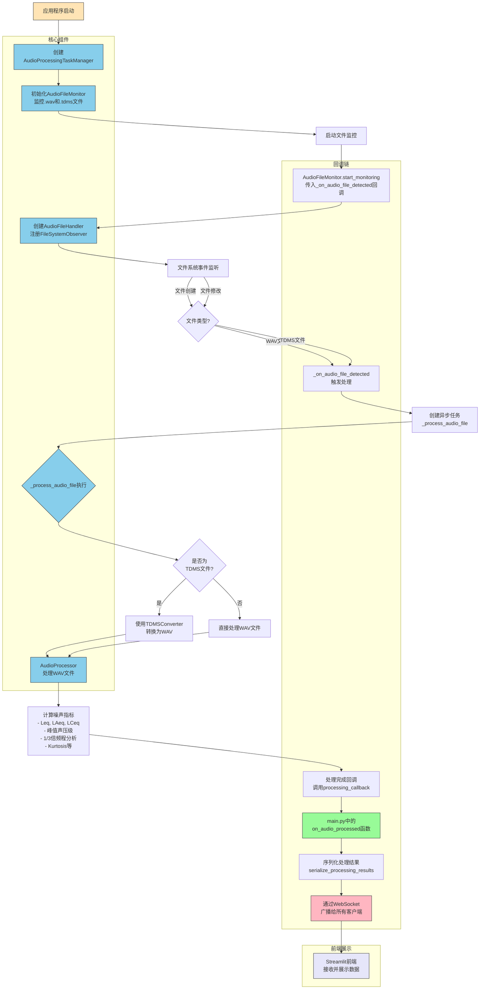

# Audio Processing Task Manager 工作流程图

## 组件交互说明

### 1. 启动阶段
1. FastAPI应用启动时创建[AudioProcessingTaskManager](file://d:/Study_and_Work/0.Main/0.Current/%E6%B5%99%E5%BB%BA/2.Code/Mine/noise_info_toolkit/app/core/background_tasks.py#L16-L77)
2. [AudioProcessingTaskManager](file://d:/Study_and_Work/0.Main/0.Current/%E6%B5%99%E5%BB%BA/2.Code/Mine/noise_info_toolkit/app/core/background_tasks.py#L16-L77)初始化[AudioFileMonitor](file://d:/Study_and_Work/0.Main/0.Current/%E6%B5%99%E5%BB%BA/2.Code/Mine/noise_info_toolkit/app/core/file_monitor.py#L36-L56)用于监控指定目录
3. 注册处理完成后的回调函数[on_audio_processed](file://d:/Study_and_Work/0.Main/0.Current/%E6%B5%99%E5%BB%BA/2.Code/Mine/noise_info_toolkit/app/main.py#L27-L35)

### 2. 监控阶段
1. [AudioFileMonitor]使用watchdog库监听文件系统事件
2. [AudioFileHandler]捕获文件创建/修改事件
3. 触发内部回调函数[_on_audio_file_detected]

### 3. 处理阶段
1. [_on_audio_file_detected]创建异步任务[_process_audio_file]
2. [_process_audio_file]根据文件类型决定是否需要转换
3. 使用[AudioProcessor]处理音频并计算噪声指标

### 4. 结果通知阶段
1. 处理完成后调用注册的回调函数
2. [on_audio_processed]序列化结果并广播给所有WebSocket客户端
3. Streamlit前端接收数据并展示