# 回调函数链路详解

```mermaid
graph LR
    A[FastAPI Lifespan<br/>应用启动] --> B[创建AudioProcessingTaskManager]
    B --> C[set_processing_callback<br/>设置on_audio_processed]
    
    C --> D[Start Monitoring<br/>start_monitoring]
    D --> E[AudioFileMonitor.<br/>start_monitoring<br/>传入_on_audio_file_detected]
    
    E --> F[创建AudioFileHandler<br/>传入_on_audio_file_detected]
    
    F --> G[Watchdog事件触发<br/>on_created/on_modified]
    
    G --> H[调用_on_audio_file_detected<br/>AudioProcessingTaskManager方法]
    
    H --> I[创建异步任务<br/>_process_audio_file]
    
    I --> J[_process_audio_file执行<br/>处理音频文件]
    J --> K[调用processing_callback<br/>即on_audio_processed]
    
    K --> L[on_audio_processed执行<br/>main.py中定义]
    L --> M[序列化结果<br/>serialize_processing_results]
    M --> N[广播到WebSocket<br/>manager.broadcast]
    
    subgraph "初始化阶段"
        A
        B
        C
        D
        E
        F
    end
    
    subgraph "事件触发阶段"
        G
        H
        I
    end
    
    subgraph "处理执行阶段"
        J
        K
    end
    
    subgraph "结果通知阶段"
        L
        M
        N
    end
    
    style A fill:#FFE4B5,stroke:#333
    style F fill:#87CEEB,stroke:#333
    style G fill:#FFB6C1,stroke:#333
    style K fill:#98FB98,stroke:#333
    style N fill:#E6E6FA,stroke:#333
```



## 回调函数链路详解

### 1. 初始化回调链路

```python
# main.py中的初始化过程
task_manager = AudioProcessingTaskManager("./audio_files")
task_manager.set_processing_callback(on_audio_processed)  # 设置顶层回调
await task_manager.start_monitoring()  # 启动监控
```

在这个过程中，建立了如下的回调链：
```
AudioFileMonitor.start_monitoring()
    ↓ (传入_on_audio_file_detected)
AudioFileHandler.__init__()
    ↓ (保存回调函数)
FileSystemEventHandler注册到Observer
```

### 2. 事件触发链路

当文件系统中有新文件创建时：
```
FileSystemEvent (watchdog)
    ↓ (触发on_created)
AudioFileHandler.on_created()
    ↓ (调用保存的回调)
AudioProcessingTaskManager._on_audio_file_detected()
    ↓ (创建异步任务)
asyncio.create_task(_process_audio_file())
```

### 3. 处理执行链路

在[_process_audio_file]中：
```
_process_audio_file()
    ↓ (处理音频文件)
AudioProcessor.process_wav_file()
    ↓ (处理完成)
processing_callback()  # 即on_audio_processed
```

### 4. 结果通知链路

[on_audio_processed]函数中：
```
on_audio_processed()
    ↓ (序列化结果)
serialize_processing_results()
    ↓ (广播结果)
ConnectionManager.broadcast()
    ↓ (发送到各WebSocket客户端)
WebSocket.send_text()
```

## 关键技术点

### 异步处理
使用`asyncio.create_task()`确保文件处理不会阻塞文件监控：

```python
def _on_audio_file_detected(self, file_path: str):
    logger.info(f"New audio file detected: {file_path}")
    # 创建异步任务，不等待完成，立即返回
    asyncio.create_task(self._process_audio_file(file_path))
```

### 回调函数的层级传递
回调函数通过多个层级传递：
1. 在应用启动时设置顶层回调
2. 在启动监控时传递给下一层
3. 最终在处理完成时逐层回调回来

### 错误处理
每层都有适当的错误处理机制：
```python
async def _process_audio_file(self, file_path: str):
    try:
        # 处理逻辑
        pass
    except Exception as e:
        logger.error(f"Error processing audio file {file_path}: {str(e)}")
```

这样的设计确保了系统的高可用性和稳定性。